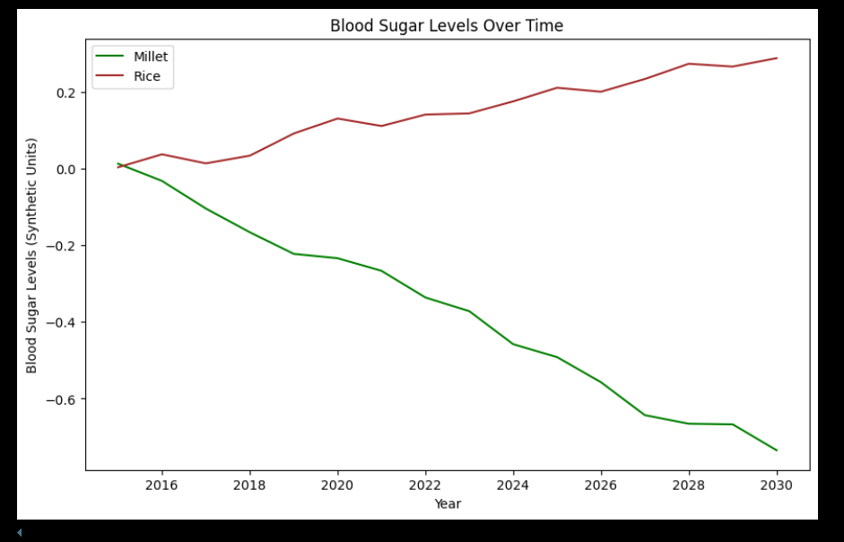
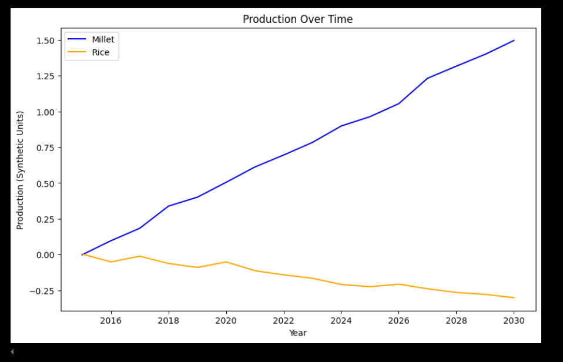
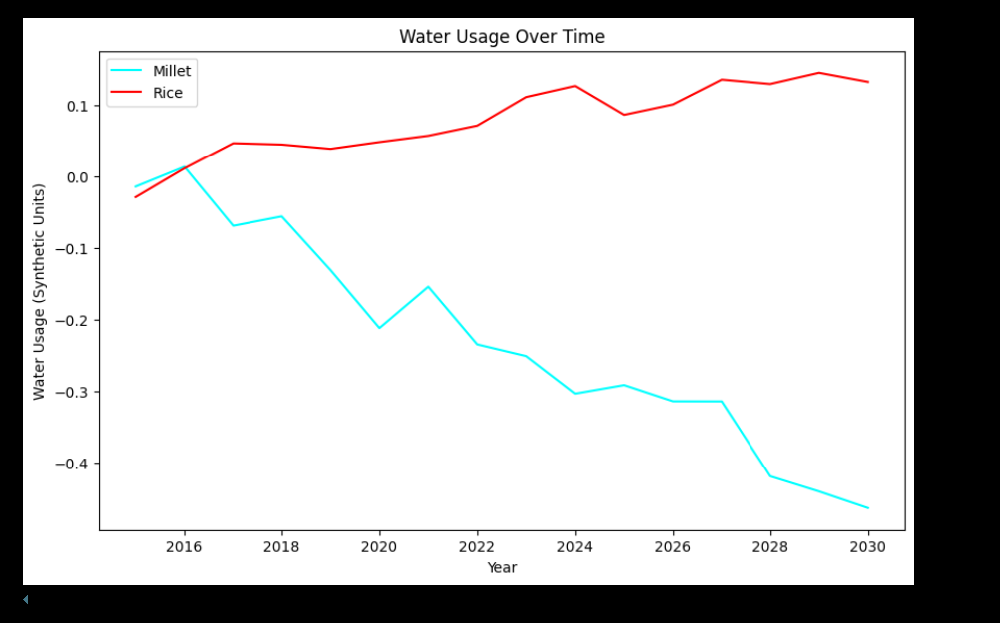
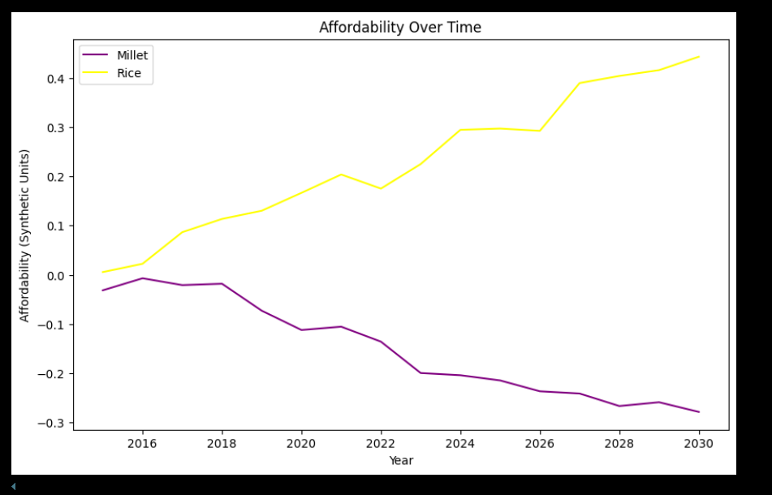

# Millet vs. Rice: A GNN-Based Multi-Criteria Analysis for Diabetes, Agriculture, and Economics in India

## Project Overview

This project delves into the intricate relationship between dietary choices, agricultural sustainability, and economic factors in India, specifically focusing on the comparative impacts of millet and white rice. Employing Graph Neural Networks (GNNs), the model is designed to analyze and forecast key indicators related to diabetes management, crop production, water resource utilization, and affordability. It addresses a multi-criteria problem, aiming to provide insights that could inform policy decisions and dietary recommendations.

## Problem Statement

India faces a growing burden of diabetes, often exacerbated by dietary habits centered around white rice consumption. Simultaneously, the country grapples with water scarcity and the need for sustainable agricultural practices. This project investigates the potential of millet as a healthier and more sustainable alternative. It seeks to quantify the benefits of shifting towards millet consumption and production in terms of blood sugar control, water efficiency, and economic viability.

## Objectives

* **Health Impact Assessment:** To model and predict the impact of millet versus rice consumption on blood sugar levels in diabetic patients.
* **Agricultural Sustainability:** To analyze and forecast the production trends and water usage associated with millet and rice cultivation.
* **Economic Analysis:** To predict the affordability of millet and rice over time, considering production volumes and market dynamics.
* **Temporal Forecasting:** To develop a model capable of predicting future trends in these key indicators.

## Methodology

1.  **Data Generation:**
    * Synthetic time-series data is generated to simulate trends in blood sugar levels, crop production, water usage, and affordability.
    * This data emulates realistic trends, including seasonal variations and long-term trends, to provide a foundation for the model.
2.  **Graph Neural Network (GNN) Model:**
    * A multi-task GNN model is implemented using PyTorch Geometric.
    * The model utilizes GCN and GAT layers to process graph-structured data, capturing relationships between different nodes (representing various factors and entities).
    * An LSTM layer is incorporated to capture temporal dependencies and forecast future trends.
3.  **Multi-Task Learning:**
    * The model predicts multiple outputs concurrently: blood sugar levels, millet/rice production, water usage, and affordability.
    * This approach enables the model to learn shared representations and improve overall performance.
4.  **Evaluation:**
    * The model's performance is evaluated using appropriate metrics for each task, including Mean Squared Error (MSE), Mean Absolute Error (MAE), and R-squared for regression tasks.
    * Further evaluations should be done using real world datasets.
5.  **Visualization:**
    * Time-series plots are generated to visualize the predicted trends and comparative impacts of millet and rice.

## Graphs

Here are the graphs generated from the synthetic data, illustrating the trends in key indicators:

1.  **Blood Sugar Levels Over Time:**
    *  
    * This graph shows the predicted blood sugar levels for millet and rice consumption over time.

2.  **Production Over Time:**
    *  
    * This graph illustrates the production trends of millet and rice, highlighting potential shifts in agricultural practices.

3.  **Water Usage Over Time:**
    *  
    * This graph compares the water usage associated with millet and rice cultivation, demonstrating the water efficiency of millet.

4.  **Affordability Over Time:**
    *  
    * This graph shows the predicted affordability of millet and rice, considering production and market dynamics.

## Technologies Used

* Python
* PyTorch
* PyTorch Geometric
* NumPy
* Pandas
* Matplotlib
* Scikit-learn

## Setup and Installation

1.  Clone the repository:

    ```bash
    git clone [repository URL:(https://github.com/KS-KARTHIK-05/Multi-Task-Learning-with-GNN-for-Diabetes-Prediction-Sustainable-Agriculture/tree/main)]
    ```

2.  Install the required dependencies:

    ```bash
    pip install torch torch-geometric numpy pandas matplotlib scikit-learn
    ```

3.  Run the main script:

    ```bash
    python [GNN.ipynb]
    ```

## Data

* `synthetic_dataset.csv`: Contains the generated synthetic dataset, serving as a foundation for the model's training and evaluation.

## Results and Potential Impact

The project aims to provide data-driven insights that can inform:

* **Public Health Policies:** By demonstrating the health benefits of millet, it can support policies promoting healthier dietary choices.
* **Agricultural Strategies:** It can guide agricultural practices towards more sustainable and water-efficient crops.
* **Economic Planning:** It can inform economic strategies related to crop production and market dynamics.

## Future Enhancements

* **Real-World Data Integration:** Incorporate real-world datasets from agricultural, health, and economic sources to improve model accuracy and relevance.
* **Advanced Feature Engineering:** Explore more sophisticated feature engineering techniques to extract meaningful patterns from the data.
* **GAN Model Refinement:** If using GANs for data generation, refine the model to produce data that closely mirrors real-world distributions.
* **Robust Evaluation Metrics:** Implement a comprehensive suite of evaluation metrics, including those specific to each task and domain.
* **Explainable AI (XAI):** Integrate XAI techniques to provide insights into the model's decision-making process, enhancing trust and usability.
* **Scalability and Deployment:** Consider the scalability of the model for larger datasets and potential deployment as a decision-support tool.
* **Geographical Specificity:** Add the ability to add geographical data to the model, for better region specific predictions.

## Contributing

Contributions are welcome! Please feel free to submit pull requests or open issues for suggestions and improvements.

## License

This project is licensed under the MIT License.

## Author

Karthik.K.S (GitHub Profile URL: https://github.com/KS-KARTHIK-05)
